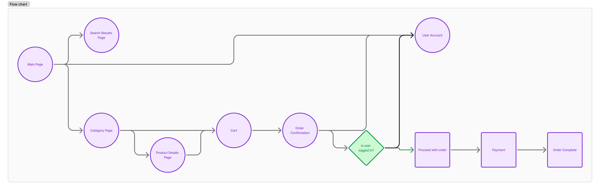

# SCC0219 - Introdução ao Desenvolvimento Web  

# Project Report: ElojobDie
-> Gabriel Hyppolito - NUSP 14571810  
-> Juan Marques Jordão - NUSP 14758742  

## 1. Requirements:
  * The project is an online store system that sells accounts, online coaching sessions, and services to boost your rank in online games.
  * The system authentication will support 2 types of users:
      - Administrators, responsible for registering/managing administrators, customers, and the products/services provided. The application comes with a default admin account (username: admin, password: admin).
      - Customers, users who access the system to purchase services/products.
  * Each customer and user record includes fields for name, email, address, phone number, and ID.
  * Each service/product record includes fields for name, ID, photo, description, price, quantity in stock, and quantity sold.
  * Selling Products (or Services): Products are selected, quantities are chosen, and added to a cart. Products are purchased using a credit card number (any number is accepted by the system). The quantity sold is subtracted from the stock and added to the total quantity sold. Carts are emptied only upon payment or by the customer.
  * Product/Service Management: Administrators can create, read, update, and delete (CRUD) products and services. For example, they can change stock quantities.
  * Users can search for desired products/services using a functional search bar.
  * Users can navigate through different product tabs.

## 2. Project Description:
  * The implemented functionalities include:
     - Login system for customers and administrators.
     - Cart to add/remove products and confirm purchases.
     - User data storage.
     - Admin permissions to change prices, stock, and availability.
     - Search bar for products.
     - Main page showcasing featured products and separate tabs for different types of services.

   * Navigation diagram (SPA) for the screen mockups:
     

      
     

   * Mockup for the Product Details Page:
     

      
     

   * Mockup for the page showing search results based on the user's query:
     

      
     

   * Mockup for the payment page:
     

      
     

   * Mockup for the confirmed purchase page:
     

      
     

     
   * All data related to storage, products, and users will be saved on a server.

## 3. Code Comments:

## 4. Test Plan:
* Back-end funcionalitites will be tested using Postman.

## 5. Test Results:

## 6. Build Procedures:

## 7. Problems:

## 8. Comments:
