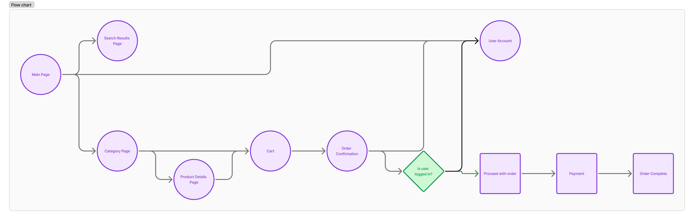
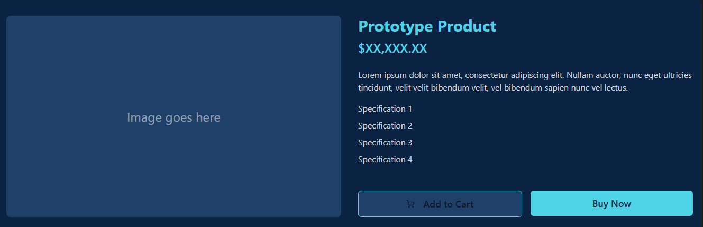
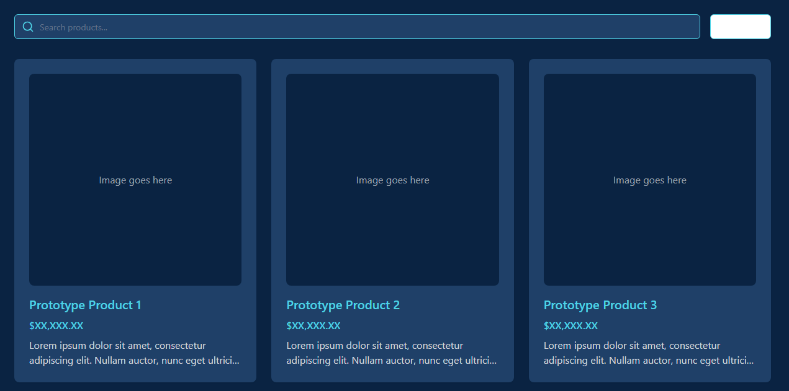
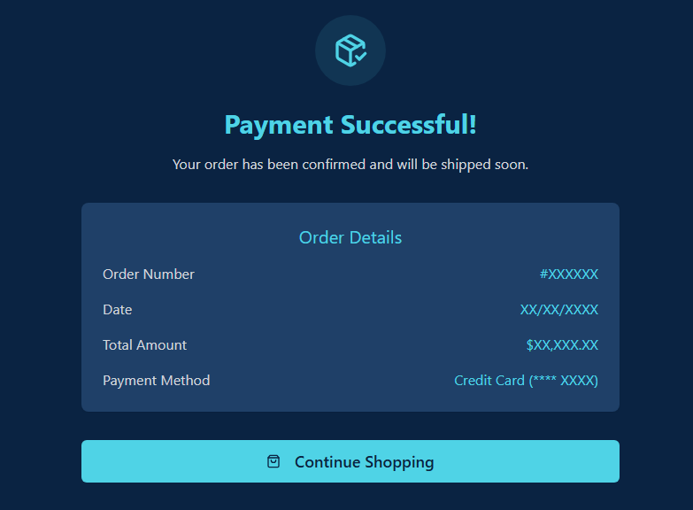

# SCC0219 - Introdução ao Desenvolvimento Web  

# Project Report: ElojobDie
-> Gabriel Hyppolito - NUSP 14571810  
-> Juan Marques Jordão - NUSP 14758742  

## 1. Requirements:
  * The project is a online store system that sells accounts, online coaching sessions and services to increase your rank in online games.
  * The system authentication will have 2 types of users:
      - Administrators, responsible for registering/managing administrators, customers, and products/services provided. The application already comes with an account admin with password admin.
      - Customers, users who acess the system to buy services/products
  * Each customer and user record includes name, email, address, phone and id fields.
  * Each service/product record includes name, id, photo, description, price, quantity (in stock) and quantity sold.
  * Selling Products (or services): Products are selected, quantity chosen, and are included in a cart. Products are purchased using a credit card number (any number is accepted by the system). The quantity of product sold is subtracted from the quantity in stock and added to the quantity sold. Carts are emptied only on payment or by          customers.
  * Product/Service Management: Administrators can create/update/read/delete (crud) new products and services. For example, they can change the stock quantity.
  * Users are able to search the desired product/service using a responsible searchbar
  * Users can navigate through different products tabs.

## 2. Project Description:
  * The functionalities being implemented are:
     - login system for customers and administrators
     - cart to add/remove products and confirm purchases
     - user data storage
     - admin permission to change prices, stock, availability
     - searchbar for products
     - main page for main products and separate tabs for different types of services

   * Navigation diagram (SPA) for the screen mockups:
     

      
     

   * Mockup for the Product Details Page
     

      
     

   * Mockup for the page that shows the compatible results of a search made by the user
     

      
     

   * Mockup for the payment page
     

      
     

   * Mockup for the confirmed purchase page
     

      
     

     
   * All storage, product and users data will be saved in a server;

## 3. Code Comments:

## 4. Test Plan:

## 5. Test Results:

## 6. Build Procedures:

## 7. Problems:

## 8. Comments:
