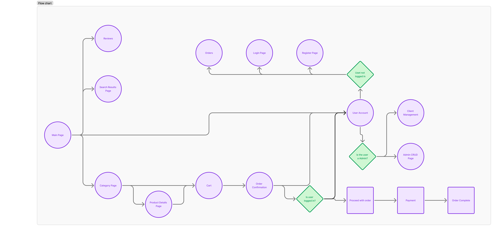
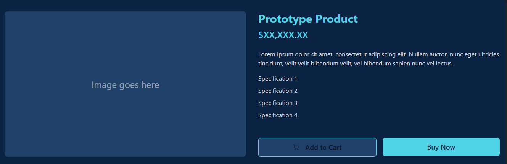
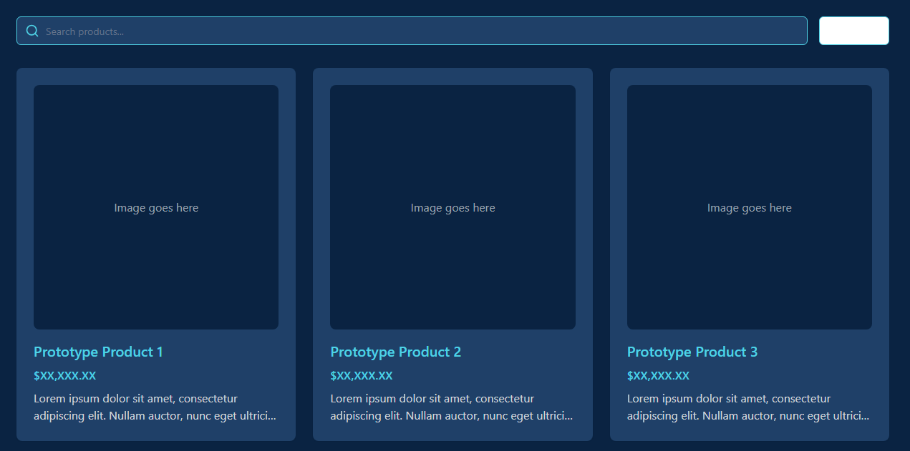
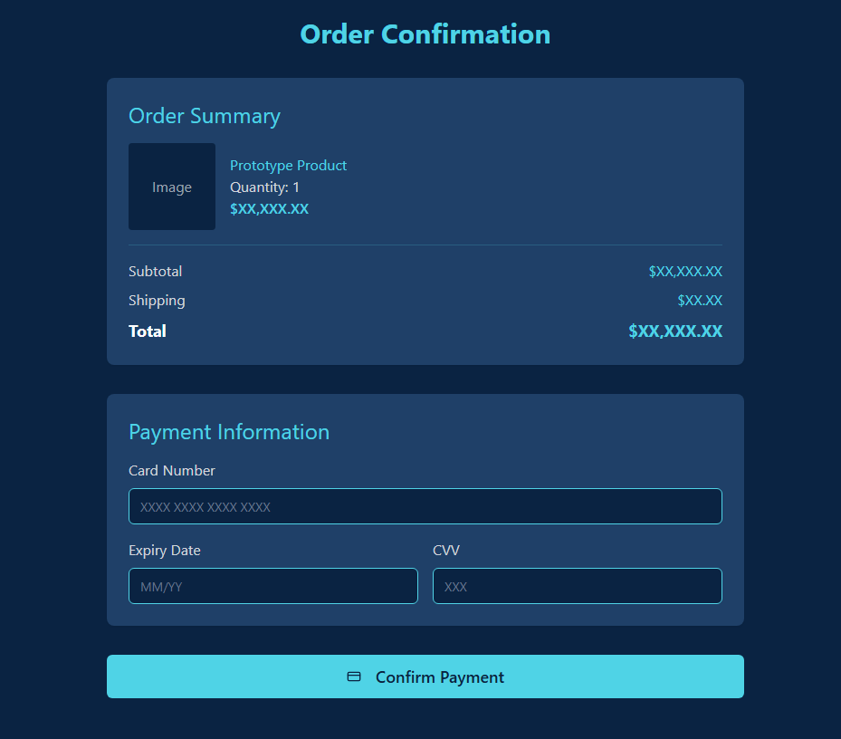
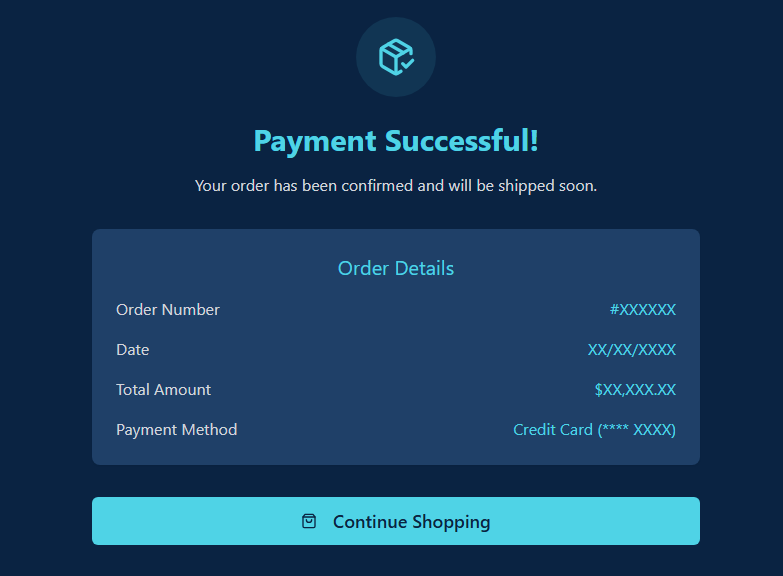
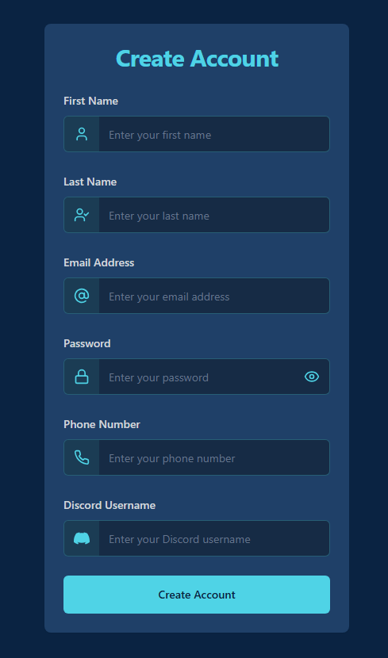
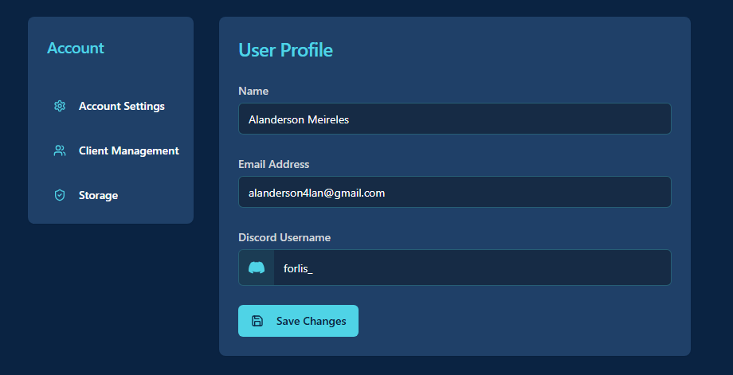
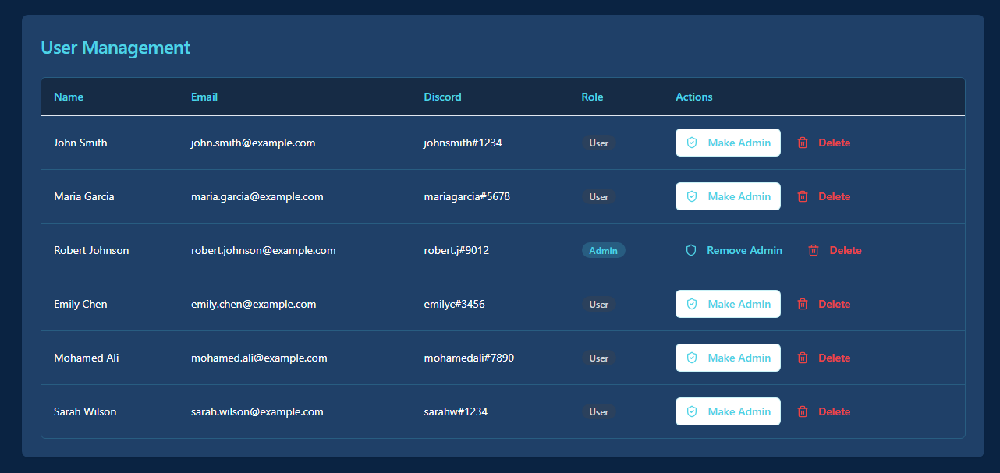
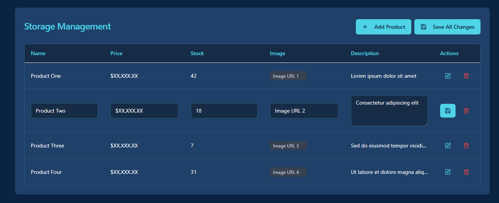

# SCC0219 - Introdução ao Desenvolvimento Web <br/>

# Project Report: ElojobDie
-> Gabriel Hyppolito - NUSP 14571810 </br>
-> Juan Marques Jordão - NUSP 14758742 </br>

## 1. Requirements:
  * The project is an online store system that sells accounts, online coaching sessions, and services to boost your rank in online games.
  * The system authentication will support 2 types of users:
      - Administrators, responsible for registering/managing administrators, customers, and the products/services provided. The application comes with a default admin account (username: admin, password: admin).
      - Customers, users who access the system to purchase services/products.
  * Each customer and user record includes fields for name, email, phone number, discord username and ID.
  * Each service/product record includes fields for name, ID, photo, description, price, quantity in stock, and quantity sold.
  * Selling Products (or Services): Products are selected, quantities are chosen, and added to a cart. Products are purchased using a credit card number (any number is accepted by the system). The quantity sold is subtracted from the stock and added to the total quantity sold. Carts are emptied only upon payment or by the customer.
  * Product/Service Management: Administrators can create, read, update, and delete (CRUD) products and services. For example, they can change stock quantities.
  * Users can search for desired products/services using a functional search bar.
  * Users can see all their orders and write reviews for delivered ones.
  * Reviews can be filtered by service type.
  * Users can navigate through different product tabs.

## 2. Project Description:
  * The implemented functionalities include:
     - Login system for customers and administrators.
     - Cart to add/remove products and confirm purchases.
     - User data storage.
     - Admin permissions to change prices, stock, and availability.
     - Search bar for products.
     - Main page showcasing featured products and separate tabs for different types of services.

    * Navigation diagram (SPA) for the screen mockups:
     <p>
      
     </p>

    * Mockup for the Product Details Page:
     <p>
      
     </p>

    * Mockup for the page showing search results based on the user's query:
     <p>
      
     </p>

    * Mockup for the payment page:
     <p>
      
     </p>

    * Mockup for the confirmed purchase page:
     <p>
      
     </p>

    * Mockup for the Register page:
     <p>
      
     </p>

    * Mockup for the User Account page:
     <p>
      
     </p>

    * Mockup for the User Management page:
     <p>
      
     </p>

    * Mockup for the Storage page:
     <p>
      
     </p>
     
   * All data related to storage, products, and users will be saved on a server.

## 3. Code Comments:
No comments.

## 4. Test Plan:
* In milestone 3 all frontend tests were made again to ensure that there were no problems with the database integration.
* Many requests were made to the server, to secure the functionality of the website features with the data received.
* Tests to the treatments of both valid and invalid data were also made.

## 5. Test Results:
* Category and specific product pages correctly filter from the product mock.
* Reviews are displayed and filtered correctly.
* The shopping cart and purchase logic correctly interact with product inventory, ensuring stock updates in the browser's local storage and blocking purchase attempts that exceed available stock or are invalid.
* It is possible to create, delete, grant admin permissions, or revoke admin rights for users correctly, with the data also being saved in the browser's local storage.
* CRUD operations on the storage are also saved locally.

## 6. Build Procedures:
Prerequisites

Node.js (version 18 or higher recommended)
npm or yarn package manager
Git (for version control)

# Initial Setup
Install Dependencies
```
#Install all project dependencies
npm install
```
Or if using yarn
```
yarn install
```

Development Build ProcessStart Development Server
```
#Start the development server with hot reloading
npm run dev
```
# The application will be available at http://localhost:5173
Code Quality Checks
  ``` 
#Run ESLint to check for code quality issues
npm run lint
```

Production Build Process
Pre-build Validation
Before building for production, ensure code quality by:
```
#Run linting checks
npm run lint
```
Production Build
```
#Create optimized production build
npm run build
```

Build verification
```
#Preview the production build locally
npm run preview
```
# The built application will be served at http://localhost:4173
## 7. Problems:
* No problems where found in the final version (Milestone 3).

## 8. Comments:
* No comments.
